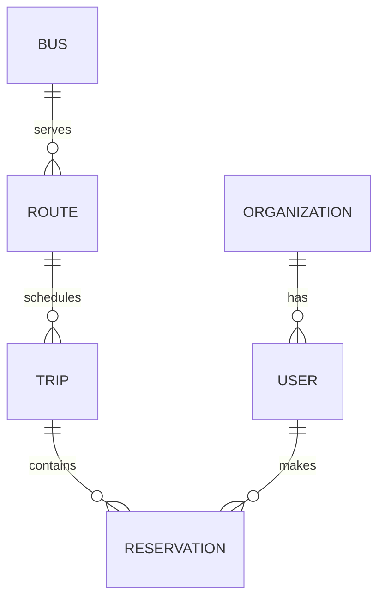

# FLEETMARK BACKEND — FULL STATUS REPORT
For Frontend Team — Merge Preparation

Snapshot audited: 2026-03-06 (local repo state)
Backend path audited: `/Users/mohamed/Desktop/ft_SSBS_transcendence_snapshot_20260305_004003/backend/src`
Test run in this snapshot: `86/86` passing (`./venv/bin/python manage.py test`)

## 1. WHAT IS 100% READY FOR FRONTEND

Criteria used for this section: implemented in code, covered by automated tests, and currently callable by frontend without backend code changes.

| Method | Endpoint | Description | Auth | Role |
|--------|----------|-------------|------|------|
| POST | `/api/v1/accounts/token/` | Login, returns JWT access+refresh | Public | Any valid user credentials |
| POST | `/api/v1/accounts/token/refresh/` | Refresh access token | Public | Any valid refresh token |
| POST | `/api/v1/accounts/token/verify/` | Verify token validity | Public | Any token holder |
| GET | `/api/v1/accounts/users/` | List users (scoped by requester) | Bearer JWT | superuser, org admin |
| POST | `/api/v1/accounts/users/` | Create user | Bearer JWT | superuser, org admin |
| GET | `/api/v1/accounts/users/{id}/` | Retrieve user by id (queryset-scoped) | Bearer JWT | authenticated |
| PATCH | `/api/v1/accounts/users/{id}/` | Partial update user | Bearer JWT | owner, org admin (same org), superuser |
| PUT | `/api/v1/accounts/users/{id}/` | Full update user | Bearer JWT | owner, org admin (same org), superuser |
| DELETE | `/api/v1/accounts/users/{id}/` | Delete user | Bearer JWT | superuser, org admin |
| GET | `/api/v1/organization/` | List organizations (scoped by requester) | Bearer JWT | authenticated |
| POST | `/api/v1/organization/` | Create organization | Bearer JWT | superuser, org admin |
| GET | `/api/v1/organization/{id}/` | Retrieve organization (queryset-scoped) | Bearer JWT | authenticated |
| PATCH | `/api/v1/organization/{id}/` | Partial update organization | Bearer JWT | superuser, org admin |
| PUT | `/api/v1/organization/{id}/` | Full update organization | Bearer JWT | superuser, org admin |
| DELETE | `/api/v1/organization/{id}/` | Delete organization | Bearer JWT | superuser, org admin |
| GET | `/api/v1/buses/` | List buses | Bearer JWT | authenticated |
| POST | `/api/v1/buses/` | Create bus | Bearer JWT | superuser, org admin |
| GET | `/api/v1/buses/{id}/` | Retrieve bus | Bearer JWT | authenticated |
| PATCH | `/api/v1/buses/{id}/` | Partial update bus | Bearer JWT | superuser, org admin |
| PUT | `/api/v1/buses/{id}/` | Full update bus | Bearer JWT | superuser, org admin |
| DELETE | `/api/v1/buses/{id}/` | Delete bus | Bearer JWT | superuser, org admin |
| GET | `/api/v1/routes/` | List routes | Bearer JWT | authenticated |
| POST | `/api/v1/routes/` | Create route | Bearer JWT | superuser, org admin |
| GET | `/api/v1/routes/{id}/` | Retrieve route | Bearer JWT | authenticated |
| PATCH | `/api/v1/routes/{id}/` | Partial update route | Bearer JWT | superuser, org admin |
| PUT | `/api/v1/routes/{id}/` | Full update route | Bearer JWT | superuser, org admin |
| DELETE | `/api/v1/routes/{id}/` | Delete route | Bearer JWT | superuser, org admin |
| GET | `/api/v1/trips/` | List trips | Bearer JWT | authenticated |
| POST | `/api/v1/trips/` | Create trip | Bearer JWT | superuser, org admin |
| GET | `/api/v1/trips/{id}/` | Retrieve trip | Bearer JWT | authenticated |
| PATCH | `/api/v1/trips/{id}/` | Partial update trip | Bearer JWT | superuser, org admin |
| PUT | `/api/v1/trips/{id}/` | Full update trip | Bearer JWT | superuser, org admin |
| DELETE | `/api/v1/trips/{id}/` | Delete trip | Bearer JWT | superuser, org admin |
| POST | `/api/v1/trips/{id}/start/` | Start trip lifecycle | Bearer JWT | superuser, org admin, driver |
| POST | `/api/v1/trips/{id}/end/` | End trip lifecycle | Bearer JWT | superuser, org admin, driver |
| GET | `/api/v1/reservations/` | List reservations | Bearer JWT | authenticated |
| POST | `/api/v1/reservations/` | Create reservation | Bearer JWT | superuser, org admin, passenger |
| GET | `/api/v1/reservations/{id}/` | Retrieve reservation | Bearer JWT | authenticated |
| DELETE | `/api/v1/reservations/{id}/` | Delete reservation | Bearer JWT | superuser, org admin, passenger |

## 2. WHAT IS STILL IN PROGRESS

| Endpoint / Feature | Status | % Done | Missing | ETA |
|---|---|---:|---|---|
| Reservations full CRUD (`PUT/PATCH /api/v1/reservations/{id}/`) | Partial | 75% | Update endpoint not implemented (`RetrieveDestroyAPIView` only) | 0.5 day |
| Trip lifecycle robustness (`/trips/{id}/start`, `/trips/{id}/end`) | Partial | 80% | Missing safe `DoesNotExist` handling and ValueError normalization to API errors | 0.5 day |
| JWT runtime config parity with docs | Partial | 60% | `SIMPLE_JWT` block not present in `settings.py`; docs claim 1h/7d + rotation | 0.5 day |

## 3. WHAT IS NOT STARTED YET

| Missing API / Feature | Priority | Estimated Build Time |
|---|---|---|
| 42 OAuth callback endpoint (`POST /api/v1/accounts/42/callback/`) | Critical | 1-2 days |
| Logout/blacklist endpoint | High | 0.5-1 day |
| Stops model + CRUD API | High | 1-2 days |
| `my reservations` dedicated endpoint/query API contract | High | 0.5 day |
| User profile endpoint (`/me`) | Medium | 0.5 day |
| Home stop field + update endpoint | Medium | 1 day |
| Notifications model + API | Medium | 1-2 days |
| Schedule config API | Medium | 1 day |
| Reports/analytics API | Low | 2-4 days |
| Standardized filter/search ordering on list endpoints | Medium | 1 day |
| Pagination (global or per-view) | Medium | 0.5 day |

## 4. EXACT REQUEST/RESPONSE FORMAT

### Auth

### POST `/api/v1/accounts/token/`
Request body:
```json
{
  "username": "string",
  "password": "string"
}
```
Response `200`:
```json
{
  "access": "string",
  "refresh": "string"
}
```
Response `401` (SimpleJWT default):
```json
{
  "detail": "No active account found with the given credentials"
}
```

### POST `/api/v1/accounts/token/refresh/`
Request body:
```json
{
  "refresh": "string"
}
```
Response `200`:
```json
{
  "access": "string"
}
```
Response `401`:
```json
{
  "detail": "Token is invalid or expired",
  "code": "token_not_valid"
}
```

### POST `/api/v1/accounts/token/verify/`
Request body:
```json
{
  "token": "string"
}
```
Response `200`:
```json
{}
```
Response `401`:
```json
{
  "detail": "Token is invalid or expired",
  "code": "token_not_valid"
}
```

### Users

### GET `/api/v1/accounts/users/`
Request body: none
Response `200`:
```json
[
  {
    "id": 1,
    "username": "string",
    "email": "user@example.com",
    "role": "admin",
    "organization": {
      "id": 1,
      "name": "Fleetmark Org"
    }
  }
]
```
Response `403`:
```json
{
  "detail": "You do not have permission to perform this action."
}
```

### POST `/api/v1/accounts/users/`
Request body:
```json
{
  "email": "new@example.com",
  "username": "newuser",
  "password": "secret123",
  "role": "driver"
}
```
Response `201`:
```json
{
  "email": "new@example.com",
  "username": "newuser",
  "role": "driver"
}
```
Response `400`:
```json
{
  "role": ["You are not allowed to assign roles."]
}
```

### GET `/api/v1/accounts/users/{id}/`
Response `200`:
```json
{
  "id": 1,
  "username": "string",
  "email": "user@example.com",
  "role": "passenger",
  "organization": {
    "id": 1,
    "name": "Fleetmark Org"
  }
}
```
Response `404` (scoped queryset):
```json
{
  "detail": "Not found."
}
```

### PATCH/PUT `/api/v1/accounts/users/{id}/`
Request body example:
```json
{
  "email": "updated@example.com"
}
```
Response `200`: same shape as GET user detail.
Response `403`:
```json
{
  "detail": "You do not have permission to perform this action."
}
```

### DELETE `/api/v1/accounts/users/{id}/`
Response `204`: empty body.

### Organizations

### GET `/api/v1/organization/`
Response `200`:
```json
[
  {
    "id": 1,
    "name": "Fleetmark Org"
  }
]
```

### POST `/api/v1/organization/`
Request body:
```json
{
  "name": "New Org"
}
```
Response `201`:
```json
{
  "id": 3,
  "name": "New Org"
}
```

### GET `/api/v1/organization/{id}/`
Response `200`:
```json
{
  "id": 1,
  "name": "Fleetmark Org"
}
```

### PATCH/PUT `/api/v1/organization/{id}/`
Request body:
```json
{
  "name": "Renamed Org"
}
```
Response `200`:
```json
{
  "id": 1,
  "name": "Renamed Org"
}
```

### DELETE `/api/v1/organization/{id}/`
Response `204`: empty body.

### Buses

### GET `/api/v1/buses/`
Response `200`:
```json
[
  {
    "id": 1,
    "matricule": "BUS-10",
    "capacity": 50
  }
]
```

### POST `/api/v1/buses/`
Request body:
```json
{
  "matricule": "BUS-11",
  "capacity": 45
}
```
Response `201`:
```json
{
  "id": 2,
  "matricule": "BUS-11",
  "capacity": 45
}
```
Response `400`:
```json
{
  "capacity": ["Ensure this value is greater than or equal to 1."]
}
```

### GET `/api/v1/buses/{id}/`
Response `200`: single bus object.
Response `404`:
```json
{
  "detail": "Not found."
}
```

### PATCH/PUT `/api/v1/buses/{id}/`
Request body:
```json
{
  "matricule": "BUS-10-NEW",
  "capacity": 60
}
```
Response `200`: updated bus.
Response `409` (freeze):
```json
{
  "error": "Cannot modify bus assigned to routes",
  "code": "freeze_error"
}
```

### DELETE `/api/v1/buses/{id}/`
Response `204`: empty body.
Response `409` (protected FK):
```json
{
  "error": "Cannot delete bus assigned to routes",
  "code": "protected_delete"
}
```

### Routes

### GET `/api/v1/routes/`
Response `200`:
```json
[
  {
    "id": 1,
    "bus": 1,
    "direction": "North -> South"
  }
]
```

### POST `/api/v1/routes/`
Request body:
```json
{
  "bus": 1,
  "direction": "East -> West"
}
```
Response `201`: created route object.
Response `400`:
```json
{
  "bus": ["Invalid pk \"999999\" - object does not exist."]
}
```

### GET `/api/v1/routes/{id}/`
Response `200`: single route object.
Response `404`:
```json
{
  "detail": "Not found."
}
```

### PATCH/PUT `/api/v1/routes/{id}/`
Request body:
```json
{
  "bus": 2,
  "direction": "South -> North"
}
```
Response `200`: updated route.

### DELETE `/api/v1/routes/{id}/`
Response `204`: empty body.
Response `409`:
```json
{
  "error": "Cannot delete route with existing trips",
  "code": "protected_delete"
}
```

### Trips

### GET `/api/v1/trips/`
Response `200`:
```json
[
  {
    "id": 1,
    "route": 1,
    "depart_time": "2026-03-06T10:00:00Z",
    "status": "CREATED",
    "start_trip_at": null,
    "end_trip_at": null
  }
]
```

### POST `/api/v1/trips/`
Request body:
```json
{
  "route": 1,
  "depart_time": "2026-03-07T08:30:00Z"
}
```
Response `201`:
```json
{
  "id": 2,
  "route": 1,
  "depart_time": "2026-03-07T08:30:00Z",
  "status": "CREATED",
  "start_trip_at": null,
  "end_trip_at": null
}
```

### GET `/api/v1/trips/{id}/`
Response `200`: single trip object.
Response `404`:
```json
{
  "detail": "Not found."
}
```

### PATCH/PUT `/api/v1/trips/{id}/`
Request body example:
```json
{
  "depart_time": "2026-03-07T09:00:00Z"
}
```
Response `200`: updated trip.
Current bug on frozen trip structural change: unhandled `ValueError` can cause `500` instead of structured API error.

### DELETE `/api/v1/trips/{id}/`
Response `204`: empty body.
Response `409`:
```json
{
  "error": "Cannot delete trip with existing reservations",
  "code": "protected_delete"
}
```

### POST `/api/v1/trips/{id}/start/`
Request body: none
Response `200`:
```json
{
  "start_trip_at": "2026-03-06T12:34:56.000000Z"
}
```
Response `400`:
```json
{
  "error": "This trip has already started.",
  "code": "lifecycle_error"
}
```
Current bug: missing-trip path can raise unhandled exception (`500`).

### POST `/api/v1/trips/{id}/end/`
Request body: none
Response `200`:
```json
{
  "end_trip_at": "2026-03-06T13:10:00.000000Z"
}
```
Response `400`:
```json
{
  "error": "Trip not started yet",
  "code": "lifecycle_error"
}
```
Current bug: missing-trip path can raise unhandled exception (`500`).

### Reservations

### GET `/api/v1/reservations/`
Response `200`:
```json
[
  {
    "id": 1,
    "trip": 1,
    "user": 4,
    "user_name": "Sara Omar",
    "user_role": "Passenger",
    "created_at": "2026-03-06T11:00:00Z"
  }
]
```

### POST `/api/v1/reservations/`
Request body:
```json
{
  "trip": 1,
  "user": 4
}
```
Response `201`:
```json
{
  "id": 2,
  "trip": 1,
  "user": 4,
  "user_name": "Sara Omar",
  "user_role": "Passenger",
  "created_at": "2026-03-06T11:05:00Z"
}
```
Response `400` (trip lifecycle):
```json
{
  "error": "Cannot reserve this non-CREATED trip",
  "code": "lifecycle_error"
}
```
Response `409` (capacity):
```json
{
  "error": "No seats available",
  "code": "capacity_error"
}
```
Response `400` (validation):
```json
{
  "user": ["This user already has a reservation for this trip."]
}
```

### GET `/api/v1/reservations/{id}/`
Response `200`: single reservation object.
Response `404`:
```json
{
  "detail": "Not found."
}
```

### DELETE `/api/v1/reservations/{id}/`
Response `204`: empty body.
Known issue: passenger can delete other users' reservations (permission gap).

### Not implemented endpoints requested by frontend scope
- Auth logout endpoint: not present.
- 42 OAuth callback endpoint: not present.
- Stops CRUD: not present.
- Notifications API: not present.
- Schedule config API: not present.
- Reports/Analytics API: not present.

## 5. EXACT FIELD NAMES

### User model (`accounts.User`)
```json
{
  "id": "integer (auto)",
  "password": "string (hashed)",
  "last_login": "datetime or null",
  "is_superuser": "boolean",
  "username": "string (Django AbstractUser max 150, unique)",
  "first_name": "string (max 150)",
  "last_name": "string (max 150)",
  "email": "string (email)",
  "is_staff": "boolean",
  "is_active": "boolean",
  "date_joined": "datetime",
  "role": "string max 10, choices: admin/driver/passenger",
  "organization": "integer FK or null -> organization.Organization"
}
```

### Organization model (`organization.Organization`)
```json
{
  "id": "integer (auto)",
  "name": "string max 50, unique"
}
```

### Bus model (`buses.Bus`)
```json
{
  "id": "integer (auto)",
  "matricule": "string max 50",
  "capacity": "positive integer"
}
```

### Route model (`routes.Route`)
```json
{
  "id": "integer (auto)",
  "bus": "integer FK -> buses.Bus (PROTECT)",
  "direction": "string max 100"
}
```

### Stop model
Not implemented (no model found).

### Trip model (`trips.Trip`)
```json
{
  "id": "integer (auto)",
  "route": "integer FK -> routes.Route (PROTECT)",
  "depart_time": "datetime",
  "status": "string max 10, choices: CREATED/STARTED/ENDED",
  "start_trip_at": "datetime or null",
  "end_trip_at": "datetime or null"
}
```

### Reservation model (`reservations.Reservation`)
```json
{
  "id": "integer (auto)",
  "trip": "integer FK -> trips.Trip (PROTECT)",
  "user": "integer FK -> accounts.User (PROTECT)",
  "created_at": "datetime (auto_now_add)"
}
```
Unique constraint:
```json
{
  "trip + user": "must be unique"
}
```

### Notification model
Not implemented (no model found).

## 6. FILTERING & QUERY PARAMS

No custom filtering/query params are implemented in list views.

| Endpoint | Supported Query Params |
|---|---|
| GET `/api/v1/accounts/users/` | none (queryset scoping by authenticated user only) |
| GET `/api/v1/organization/` | none |
| GET `/api/v1/buses/` | none |
| GET `/api/v1/routes/` | none |
| GET `/api/v1/trips/` | none |
| GET `/api/v1/reservations/` | none |

Notes:
- `?user=me`, `?date=...`, `?status=...`, `?trip=...` are not implemented.
- `my reservations` is not separately implemented.

## 7. PAGINATION

No pagination is configured.

- No global DRF pagination class in `REST_FRAMEWORK`.
- List endpoints return full arrays directly.
- Current list response shape:
```json
[
  {...},
  {...}
]
```

## 8. ERROR RESPONSE FORMAT

Two active formats are used.

### A) Custom domain errors (`core.exception_handler`)
```json
{
  "error": "Human readable message",
  "code": "machine_readable_code"
}
```

### B) DRF default errors
```json
{
  "detail": "..."
}
```
or field errors:
```json
{
  "field_name": ["..."]
}
```

| Code | HTTP Status | When it happens |
|------|-------------|-----------------|
| `lifecycle_error` | 400 | Invalid trip lifecycle operation |
| `freeze_error` | 409 | Modifying frozen bus |
| `capacity_error` | 409 | Reservation on full trip |
| `protected_delete` | 409 | Deleting object with protected FK dependencies |
| `integrity_error` | 409 | Generic integrity mapping in exception handler |
| `token_not_valid` | 401 | Invalid/expired JWT |

Per endpoint behavior summary:
- Buses/Routes/Trips/Reservations may return custom `{error, code}` for domain/protected errors.
- Auth endpoints return SimpleJWT/DRF default format.
- Validation (`400`) returns DRF field errors.
- Permission/auth failures (`401/403`) return DRF `detail` format.

## 9. AUTHENTICATION DETAILS

- Token type: Bearer JWT
- Authentication backend: `rest_framework_simplejwt.authentication.JWTAuthentication`
- Access token lifetime: **not explicitly configured in code** (falls back to SimpleJWT defaults)
- Refresh token lifetime: **not explicitly configured in code** (falls back to SimpleJWT defaults)
- Token rotation: **not explicitly configured in code**
- JWT docs in repo claim `1 hour / 7 days / rotation`, but `settings.py` has no `SIMPLE_JWT` block.

Public endpoints:
- `POST /api/v1/accounts/token/`
- `POST /api/v1/accounts/token/refresh/`
- `POST /api/v1/accounts/token/verify/`

All other API endpoints require Bearer token.

Role matrix:
- superuser: full access everywhere.
- org admin (`role=admin`): CRUD on main resources.
- driver: read buses/routes/trips/reservations + can start/end trip.
- passenger: read buses/routes/trips/reservations + create/delete reservation.

## 10. MISSING CRITICAL FEATURES

### CRITICAL (blocks frontend completely)
- 42 OAuth callback API.
- Why needed: frontend cannot complete 42 login flow.
- ETA: 1-2 days.

### HIGH (needed for core flow)
- Logout/refresh blacklisting strategy endpoint.
- Why needed: clean session termination and token invalidation.
- Stops domain (model + CRUD) absent.
- Why needed: route planning UI cannot bind stop data.
- Reservation ownership enforcement + `my reservations` endpoint/filter.
- Why needed: user dashboard and secure self-service flows.

### MEDIUM (nice to have)
- Pagination for scalability.
- Notifications API.
- Schedule configuration API.
- Reports/analytics API.
- `/accounts/me` profile convenience endpoint.

## 11. KNOWN BUGS

| Bug | File | Line | Severity | Status |
|-----|------|------|----------|--------|
| Missing 404 guard for missing trip in start endpoint (`Trip.objects.get`) can crash to 500 | `trips/views.py` | 60 | High | Pending |
| Missing 404 guard for missing trip in end endpoint (`Trip.objects.get`) can crash to 500 | `trips/views.py` | 81 | High | Pending |
| Unhandled `ValueError` for trip structural freeze returns server error instead of domain error | `trips/models.py` | 66 | High | Pending |
| `Trip.start()` and `Trip.end()` raise raw `ValueError` for domain validation; not normalized | `trips/models.py` | 87-90, 98 | High | Pending |
| Any passenger can delete any reservation (no ownership check) | `reservations/permissions.py` | 59-60 | Critical | Pending |
| Passenger can create reservation for arbitrary user id (impersonation risk) | `reservations/serializers.py` | 8 | Critical | Pending |
| JWT lifetime/rotation claims in docs do not match runtime config (`SIMPLE_JWT` missing) | `config/settings.py` | 143-148 | Medium | Pending |
| CORS not configured (`corsheaders` missing), may block frontend cross-origin calls | `config/settings.py` | 48-74 | Medium | Pending |
| Dev security defaults (`DEBUG=True`, hardcoded `SECRET_KEY`) | `config/settings.py` | 38, 41 | Medium | Pending |

## 12. ENVIRONMENT & SETUP

Local run steps (from this repo layout):

1. `cd /Users/mohamed/Desktop/ft_SSBS_transcendence_snapshot_20260305_004003/backend/src`
2. `python3 -m venv venv`
3. `source venv/bin/activate`
4. `pip install -r requirements.txt`
5. Optional: copy project env file if your team adds one (`.env.example` currently at repo root)
6. `python manage.py migrate`
7. `python manage.py createsuperuser`
8. `python manage.py runserver`

Test run:
1. `./venv/bin/python manage.py test`
2. Current snapshot result: `86 passed`.

## 13. DATABASE SCHEMA



Relationship details:
- `Organization (1) -> (N) User`
- Type: One-to-Many.
- Required: optional on `User` (`null=True`, `blank=True`).
- Delete behavior: `CASCADE` (deleting org deletes its users).

- `Bus (1) -> (N) Route`
- Type: One-to-Many.
- Required: required on `Route`.
- Delete behavior: `PROTECT` from `Route` side (bus cannot be deleted if routes exist).

- `Route (1) -> (N) Trip`
- Type: One-to-Many.
- Required: required on `Trip`.
- Delete behavior: `PROTECT` from `Trip` side.

- `Trip (1) -> (N) Reservation`
- Type: One-to-Many.
- Required: required on `Reservation`.
- Delete behavior: `PROTECT` from `Reservation` side.

- `User (1) -> (N) Reservation`
- Type: One-to-Many.
- Required: required on `Reservation`.
- Delete behavior: `PROTECT` from `Reservation` side.

- Additional constraint:
- `Reservation(trip, user)` must be unique.

## 14. 42 OAUTH STATUS

Endpoint status for `POST /api/v1/accounts/42/callback/`:
- Exists: NO
- Tested: NO
- Working: NO
- Ready date: TBD (estimate 1-2 days once started)

Expected success contract (not implemented yet):
```json
{
  "access": "...",
  "refresh": "...",
  "user": {
    "id": 1,
    "username": "...",
    "role": "passenger",
    "is_new_user": true
  }
}
```

## 15. WHAT FRONTEND TEAM NEEDS TO KNOW

- All implemented business endpoints require JWT Bearer auth.
- No pagination and no filters are available on list endpoints right now.
- Endpoint paths include trailing slash.
- No CORS config is present; if FE runs on different origin, use Vite proxy or add CORS backend config.
- Reservations API currently allows passenger-side unsafe behavior:
- Passenger can set `user` explicitly in create payload.
- Passenger can delete any reservation.
- Trip lifecycle endpoints can return server error in some invalid states (missing trip id, raw `ValueError`).
- There is no `Stop`, `Notification`, `ScheduleConfig`, or `Analytics` API yet.
- There is no `accounts/me`, `home_stop`, `assigned_bus`, or OAuth 42 callback endpoint in this snapshot.

## 16. WHAT STILL NEEDS TO BE BUILT (HONEST TIMELINE)

| Feature | Owner | Status | ETA |
|---------|-------|--------|-----|
| Fix trip lifecycle unhandled exceptions (`ValueError`, missing trip 404) | Backend team | Pending | today |
| Enforce reservation ownership and self-create rules | Backend team | Pending | today |
| Add CORS support for FE integration | Backend team | Pending | today |
| Add explicit `SIMPLE_JWT` settings (lifetime + rotation) or fix docs | Backend team | Pending | today |
| Add reservation update endpoints or document immutable reservation policy | Backend team | Pending | tomorrow |
| 42 OAuth callback endpoint | Backend team | Not started | 1-2 days |
| Stops API | Backend team | Not started | 1-2 days |
| Notifications API | Backend team | Not started | 1-2 days |
| Schedule config API | Backend team | Not started | 1 day |
| Reports/Analytics API | Backend team | Not started | 2-4 days |

---

## BONUS: Postman/Bruno Collection

No Postman or Bruno collection file was found in this repository snapshot (`*.bru` / `*postman*.json` / `*collection*.json`).
